# [Code quality testing with SonarQube and Gitlab CI for PHP applications](https://medium.com/@nicolastournier/code-quality-testing-with-sonarqube-and-gitlab-ci-for-php-applications-f0c953f4133d)

During the lifecycle of an application in continuous integration and continuous delivery   pipelines, we need to build, test, and deliver. The testing phase is the most important and each kind of tests has its specificity. In this article, we deal with code quality tests, such as static code analysis and code coverage, for PHP applications using SonarQube and Gitlab CI.

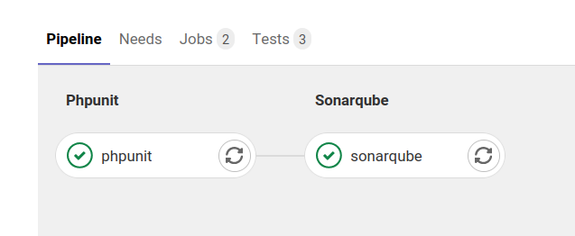

First, we take our time to create the building stage of the application in Gitlab CI. Then, we focus on the testing stage and code coverage. Furthermore, we are looking how to deploy SonarQube using Docker. And finally, showing in SonarQube the kind of useful information you can collect.

Code sources are available [here](https://github.com/Treeptik/php-code-quality-testing-sonar-gitlab-ci).

## Building PHP applications in Gitlab with Composer

[Gitlab](https://www.gitlab.com) is a SaaS to collaborate on code and embed some tools in order to be considered as a DevOps platform. In this section, step by step, we deal with the CI of the build of PHP applications.

Even if we want to focus on quality testing, beginning the project from scratch can be interesting. You can skip this section if you want to get into the main issue.

### Requirements for building PHP application in Gitlab

- Git
- Composer
- [Gitlab](https://www.gitlab.com) account

> For those who are not PHP developers, Composer is the PHP dependency manager binary tool ; such as Maven or Gradle for Java, NPM or Yarn for JavaScript, Cargo for Rust, etc. The composer.json file describes the dependencies.

### Gitlab CI pipeline for PHP applications

To begin our pipeline, we choose the official PHP Docker image on Docker hub. Before scripting, we need to install composer in order to download the PHP dependencies. Moreover, to be installed, some packages need `git` or `unzip` packages.

The simplest way to write this step for Gitlab CI may seem like this:

```yml
php:
  stage: build
  image:
    name: php:8.0
  before_script:
    - apt-get update -yqq
    - apt-get install git unzip -yqq
    - php -r "copy('https://getcomposer.org/installer', 'composer-setup.php');"
    - php composer-setup.php --install-dir=/usr/bin --filename=composer --version=2.0.9
    - php -r "unlink('composer-setup.php');"
  script:
    - composer install
```

[https://gist.github.com/n1c0l4stournier/be0fe41ee74b3628ae9d656a5ab0deb8](https://gist.github.com/n1c0l4stournier/be0fe41ee74b3628ae9d656a5ab0deb8)

> For every tools you use, it is important to set the version in order to expect the same behavior on your local machine and in Gitlab CI. As you can see (cf. line 9), when this article is written, the latest version for composer is the `2.0.11`.

For more information of the Composer installation, you can see the [documentation](https://getcomposer.org/download/).

To be more effective, you can add some cache for the downloaded libraries and some conditions to trigger the pipeline only on merge requests or on the master/main branch.

```yml
php:
  stage: build
  image:
    name: php:8.0
  before_script:
    - apt-get update -yqq
    - apt-get install git unzip -yqq
    - php -r "copy('https://getcomposer.org/installer', 'composer-setup.php');"
    - php composer-setup.php --install-dir=/usr/bin --filename=composer --version=2.0.9
    - php -r "unlink('composer-setup.php');"
  script:
    - composer install
  cache:
    key: "${CI_JOB_NAME}-build"
    paths:
      - vendor
  only:
    - merge_requests
    - master
```

[https://gist.github.com/n1c0l4stournier/83cb035cf6ab2381c2efa64dc449d0b4](https://gist.github.com/n1c0l4stournier/83cb035cf6ab2381c2efa64dc449d0b4)

> You can use a trusted Docker image or build yours, that includes the tools you need. It will simplify the description of the pipeline in .`gitlab-ci.yml` file and can reduce the pipeline execution time. Nevertheless, it will be an other project you will have to maintain.

## Testing and code coverage for PHP applications

Our pipeline download the libraries that the application needs. The aim is to generate report in SonarQube, on static code analysis and code coverage. In order to generate code coverage report, we also need to test the application.

### PHPUnit in Gitlab CI

PHPUnit is the most used library for unit testing in PHP. Furthermore, we need Xdebug, a module for debugging and profiling PHP application. It is also used for code coverage analysis. It is available using `pecl` the binary for PHP extension installation from its repository, and in a Docker container context, you have to enable the extension using `docker-php-ext-enable`.

Adding the installation before scripting and the pipeline becomes:

```yml
php:
  stage: build
  image:
    name: php:8.0
  before_script:
    - apt-get update -yqq
    - apt-get install git unzip -yqq
    - php -r "copy('https://getcomposer.org/installer', 'composer-setup.php');"
    - php composer-setup.php --install-dir=/usr/bin --filename=composer --version=2.0.11
    - php -r "unlink('composer-setup.php');"
    - pecl install xdebug-3.0.0
    - docker-php-ext-enable xdebug
  script:
    - composer install
  cache:
    key: "${CI_JOB_NAME}-build"
    paths:
      - vendor
  only:
    - merge_requests
    - master
```

[https://gist.github.com/n1c0l4stournier/ac9f34c90eb683569697fd8958203ccb](https://gist.github.com/n1c0l4stournier/ac9f34c90eb683569697fd8958203ccb)

The `composer.json` file describe the dependencies. As we can see bellow, PHPUnit is a development dependency downloaded during the build step. PHPUnit executable is available in the directory `vendor/bin/`.

```json
{
    "name": "linkbynet/demo-php-code-quality-testing-sonar-gitlab-ci",
    "description": "Code quality testing with SonarQube and Gitlab CI for PHP applications",
    "authors": [
        {
            "name": "Nicolas Tournier",
            "email": "n.tournier@linkbynet.com"
        }
    ],
    "require": {
        "php": ">=7.3"  
    },
    "require-dev": {
        "phpunit/phpunit": "^9.5"
    },
    "autoload": {
        "psr-4": {
            "LBN\\Demo\\": "src/"
        }
    },
    "autoload-dev": {
        "psr-4": {
            "LBN\\Tests\\": "tests/"
        }
    }
}
```

[https://gist.github.com/n1c0l4stournier/5ce42323b4a6cea0e60a28faab89b297](https://gist.github.com/n1c0l4stournier/5ce42323b4a6cea0e60a28faab89b297)

Considering, `tests` is the name of the directory where the unit tests are stored ; to launch tests, you have only to execute:

```bash
./vendor/bin/phpunit tests
```

You can configure PHPUnit thanks to a XML configuration file or/and in command line. For this simple demonstration, command line is enough.

With Xdebug activated in coverage mode, for testing and some integration in Gitlab interface (cf. next subsection), this is the minimal command we need to execute. If you need more details, you can read this part of [documentation](https://phpunit.readthedocs.io/fr/latest/textui.html).

```bash
./vendor/bin/phpunit \
  --coverage-text \
  --log-junit build/phpunit/phpunit.xml \
  --whitelist src \
  --colors=never \
  tests
```

The activation of Xdebug in coverage mode is mage by setting the environment variable `XDEBUG_MODE=coverage`.

So, the Gitlab pipelines becomes:

```yml
phpunit:
  stage: build
  image:
    name: php:8.0
  before_script:
    - apt-get update -yqq
    - apt-get install git unzip -yqq
    - php -r "copy('https://getcomposer.org/installer', 'composer-setup.php');"
    - php composer-setup.php --install-dir=/usr/bin --filename=composer --version=2.0.9
    - php -r "unlink('composer-setup.php');"
    - pecl install xdebug-3.0.0
    - docker-php-ext-enable xdebug
  variables:
    XDEBUG_MODE: "coverage"
  script:
    - composer install
    - |
      ./vendor/bin/phpunit \
        --coverage-text \
        --log-junit build/phpunit.xml \
        --whitelist src \
        --colors=never \
          tests
  cache:
    key: "${CI_JOB_NAME}-build"
    paths:
      - vendor
  artifacts:
    reports:
      junit: build/phpunit.xml
    expire_in: 30 min
  only:
    - merge_requests
    - master
```

[https://gist.github.com/n1c0l4stournier/d4290059a9c74cbf7f87b654447bf92c](https://gist.github.com/n1c0l4stournier/d4290059a9c74cbf7f87b654447bf92c)

As you can see, we choose some options for PHPUnit that can be discussed.

First, we choose to export the unit tests logs with the JUnit format. Because you can integrate the results in the Gitlab interface. And this is some examples.

Then, the following three other options are for code covering. The white list directory stands for the source code directory to analyze. We choose to print the report in the console, because Gitlab can parse the result and embed it in the interface or generate a badge. And, in order to avoid parsing errors, the syntax color printing is disabled.

### Integration of results in Gitlab interface

#### Coverage integration

Tn order to have coverage metric integration, you have to follow these steps.

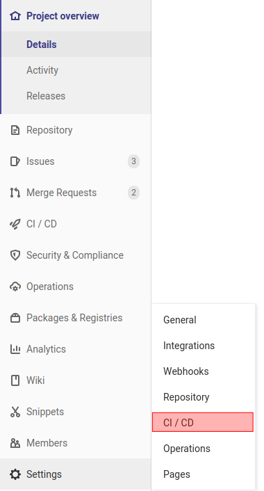

In **Settings > CI/CD**, expend **General pipelines**:

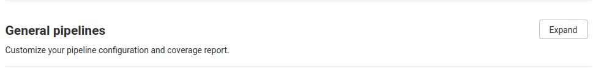

And look for **Test coverage parsing**:


Like on the screenshot, you have to type:

```bash
^\s*Lines:\s*\d+.\d+\%
```

Then, just bellow, you have two sections **Pipeline status** and **Coverage report**, that generate an icon that you can paste in the `README.md` file to know at a look the status of the repository.

Then, in the merge request, the first information appeared is the coverage rate and the evolution compared with the previous build. As you can see on the following screenshot, tests cover 86.36% of the code and before it was at 100%.

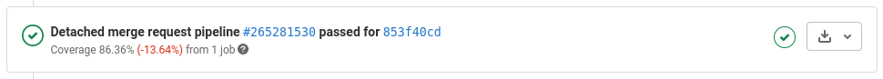

#### PHPUnit tests integration

Below few blocks, the is as summary of the PHPUnit report and a link to see the details. This is possible only if you export unit tests logs as JUnit format, in the PHPUnit options.

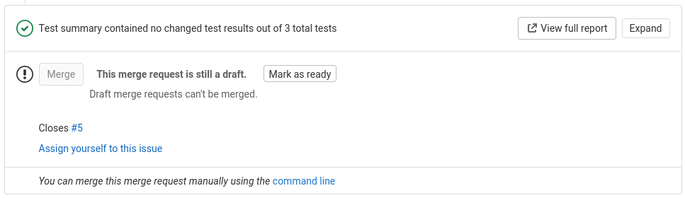

When you look at the details, there is the name of the Gitlab CI job associated to the PHPUnit tests. And, if you click on the job name, here phpunit, you have the detail for each test functions.


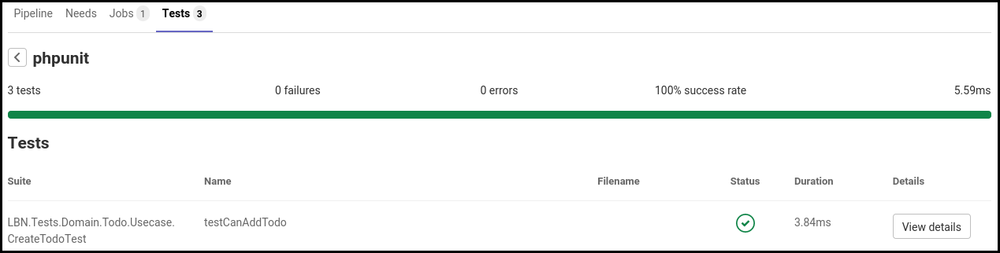

This is quite interesting to have these general metrics directly in Gitlab ; but to have more details, it is more comfortable to use complementary tools such as SonarQube.

## SonarQube with Docker

SonarQube is an automatic code review tool to detect bugs, vulnerabilities, and code smells in your code. There are three editions available for SonarQube, you can compare these in the official website. We choose the community edition, because it is free and open source. And, the features are enough to show the potential of the tool.

For the deployment, SonarQube needs a database. It is compatible with Microsoft SQL Server, Oracle and PostgreSQL. For the example, we choose SonarQube community edition and PostgreSQL.

### Requirements for SonarQube with Docker

- Docker

### SonarQube deployment

For the deployment, we are using Docker. As following, the docker-compose file describe the two services we use: SonarQube community edition and PostgreSQL. The environment variables for SonarQube and PostgreSQL are the credentials to the database.

```yml
version: "3.8"
services:
  sonar:
    image: sonarqube:8.7.0-community
    environment:
      SONARQUBE_JDBC_URL: jdbc:postgresql://db:5432/sonarDbName
      SONARQUBE_JDBC_USERNAME: sonarDbUsername
      SONARQUBE_JDBC_PASSWORD: sonarDbPassword
    ports:
      - 9000:9000
    volumes:
      - sonarqube_conf:/opt/sonarqube/conf
      - sonarqube_data:/opt/sonarqube/data
      - sonarqube_extensions:/opt/sonarqube/extensions
      - sonarqube_bundled-plugins:/opt/sonarqube/lib/bundled-plugins
  db:
    image: postgres:13.2
    environment:
      POSTGRES_USER: sonarDbUsername
      POSTGRES_PASSWORD: sonarDbPassword
      POSTGRES_DB: sonarDbName
    ports:
      - 5432:5432
    volumes:
      - postgresql:/var/lib/postgresql
      - postgresql_data:/var/lib/postgresql/data
volumes:
  sonarqube_conf:
  sonarqube_data:
  sonarqube_extensions:
  sonarqube_bundled-plugins:
  postgresql:
  postgresql_data:
```

[https://gist.github.com/n1c0l4stournier/19baa24c7047e276be650921d365ebf0](https://gist.github.com/n1c0l4stournier/19baa24c7047e276be650921d365ebf0)

> Today, the release version is `8.7.0-community`, do not hesitate to update your file by consulting the Docker Hub page. You have to avoid to use the latest version in your `docker-compose.yml` file. Keep the best practice and fix the version to avoid bad surprises.

From the docker-compose file, the best way to deploy the stack is the use Docker with the [Swarm](https://docs.docker.com/engine/swarm/) mode, even if you only have one node.

> If you prefer using Kubernetes cluster for tooling, SonarQube can also be deployed on this platform.

```bash
docker stack deploy -c docker-compose.yml sonar
```

In order to check if the deployment is successful you can list the stack and the services, you will have two services running.

```bash
docker stack ls
```

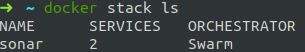

```bash
docker stack services sonar
```

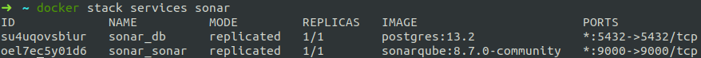


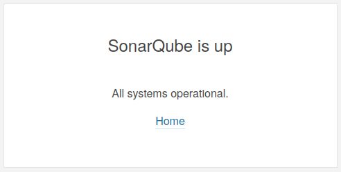

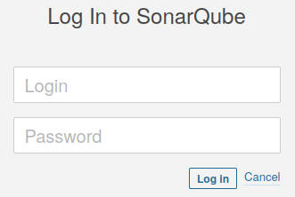

SonarQube is exposed on the port 9000, so the URL `http://{IP_ADDR}:9000` will display the login form. The default value are admin/admin as login/password entries. Then, SonarQube ask you changing this password.

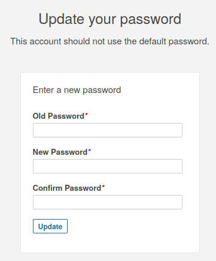

The SonarQube instance is ready, now we can set up the Gitlab CI pipeline.

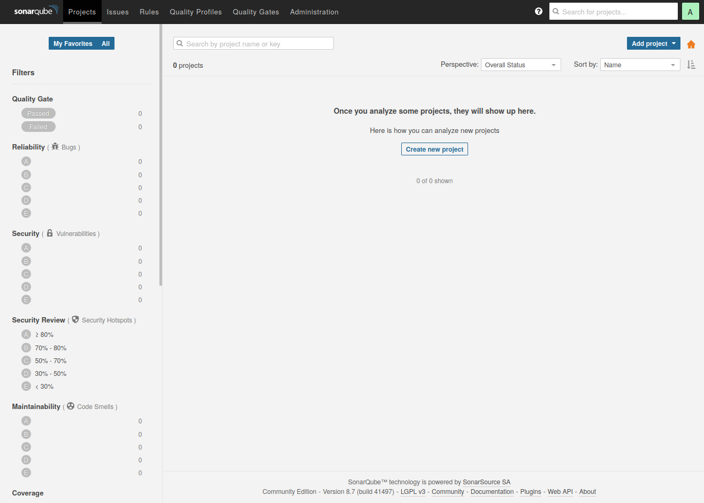

### New project on SonarQube

SonarQube is ready, you have to create your first project. From scratch, only the manual option is active. You can activate Azure DevOps, Bitbucket, Github, Gitlab in **Administration** menu and choose the **ALM integration** tab.

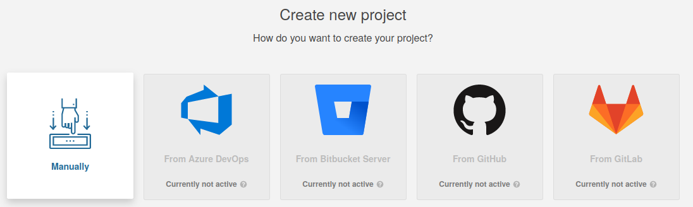

Then, you have to give a name of the project. For consistency, I choose the same name in composer project name. The display name can be change.

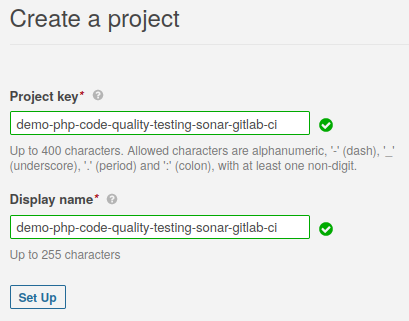

And, you have to generate a key, by naming the token and clicking on generate. With the project name it permits to authenticate your request when you have to upload your PHPUnit reports.

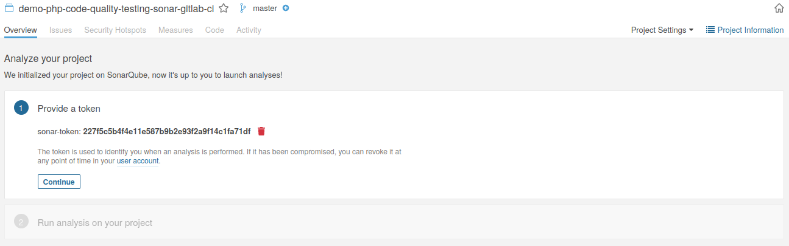

Finally, you can chose what king of technology you use for your project and some solution are proposed to execute sonar analysis and upload the reports. We will come back on this topic when we build our sonar step in Gitlab CI.

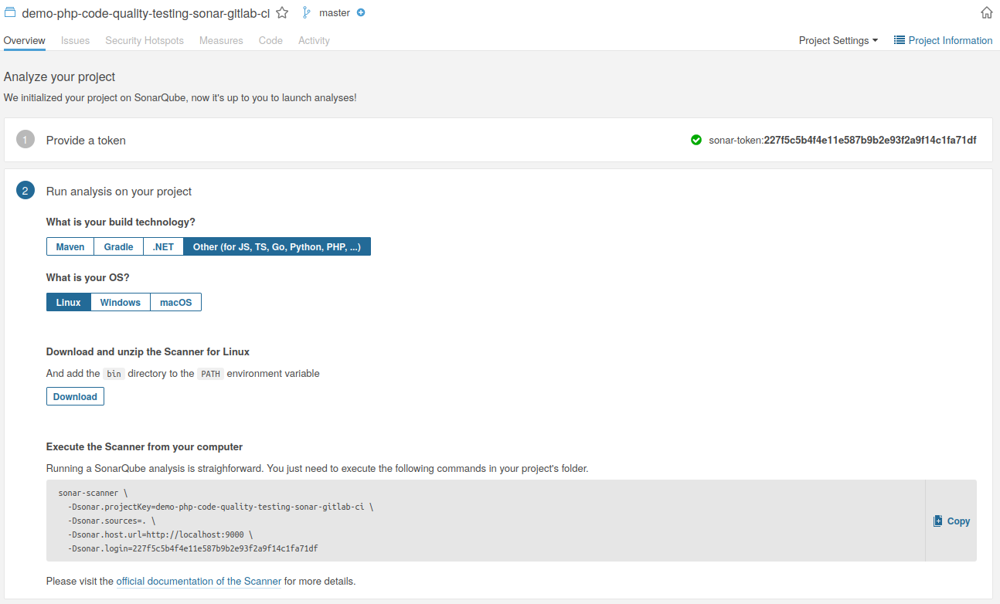

It's done ! Your project appears in the home page. On the left, when you will have lots of project, they can be filtered by Sonar criteria, such as: quality gate, reliability, security, coverage rate, maintainability, language, etc.

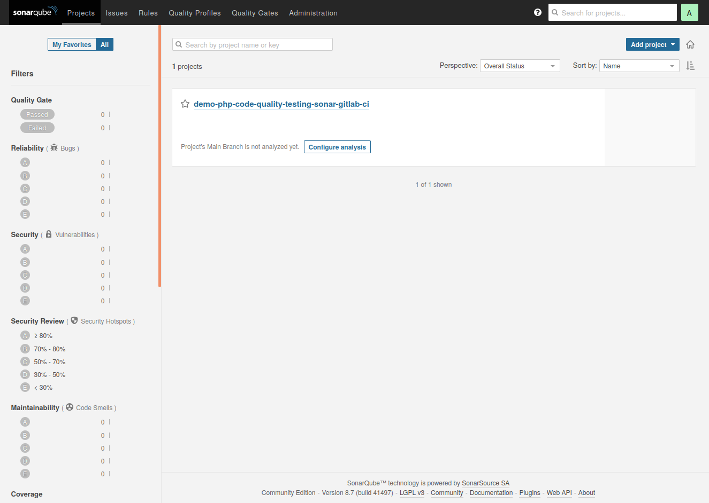

For the next step, two values are important:

- the name of the sonar project (not the display name)
- the generated key for this project

## Adding SonarQube in the Gitlab pipeline

For the SonarQube job, we are using the sonar-scanner CLI Docker image in our Gitlab pipeline.

### PHPUnit job adjustments

First, we add some clarity with two stages to be executed in this order. The order is important, because PHPUnit produces the unit tests report and the coverage report, that we need in SonarQube job.

Then, we need to produce a coverage report, we have to choose the Clover report format to be compatible with SonarQube. And, we create it in the same directory than the unit test report.

To make this files available in the next job, we have to use artifacts in Gitlab CI. Remember, we had use this to embed unit test result in Gitlab CI. In this part, we add the path where the reports are produce.

```yml
stages:
  - phpunit
  - sonarqube

phpunit:
  stage: phpunit
  image:
    name: php:8.0
  before_script:
    - apt-get update -yqq
    - apt-get install git unzip -yqq
    - php -r "copy('https://getcomposer.org/installer', 'composer-setup.php');"
    - php composer-setup.php --install-dir=/usr/bin --filename=composer --version=2.0.11
    - php -r "unlink('composer-setup.php');"
    - pecl install xdebug-3.0.0
    - docker-php-ext-enable xdebug
  cache:
    key: ${CI_JOB_NAME}
    paths:
      - vendor
  variables:
    XDEBUG_MODE: "coverage"
  script:
    - composer install
    - |
      ./vendor/bin/phpunit \
        --whitelist src/Domain \
        --log-junit build/phpunit.xml \
        --coverage-text \
        --coverage-clover build/coverage.xml \
        --colors=never \
          tests
  artifacts:
    paths:
      - build
    reports:
      junit: build/phpunit.xml
    expire_in: 30 min
  only:
    - merge_requests
    - master

sonarqube:
  stage: sonarqube
  image:
    name: sonarsource/sonar-scanner-cli:4.6
    entrypoint: [""]
  variables:
    IP_SONAR_MACHINE: "10.1.1.1"
  cache:
    key: "${CI_JOB_NAME}"
    paths:
      - .sonar/cache
      - .scannerwork
  script:
    - |
      sonar-scanner \
        -Dsonar.language=php \
        -Dsonar.qualitygate.wait=true \
        -Dsonar.sources=src/Domain \
        -Dsonar.host.url=http://${IP_SONAR_MACHINE}:9000 \
        -Dsonar.php.tests.reportPath=build/phpunit.xml \
        -Dsonar.php.coverage.reportPaths=build/coverage.xml \
        -Dsonar.projectKey=demo-php-code-quality-testing-sonar-gitlab-ci \
        -Dsonar.login=227f5c5b4f4e11e587b9b2e93f2a9f14c1fa71df
  only:
    - merge_requests
    - master
```

[https://gist.github.com/n1c0l4stournier/74d5ff2595f4c8abf501eb4f9df186b3](https://gist.github.com/n1c0l4stournier/74d5ff2595f4c8abf501eb4f9df186b3)

### SonarQube job

`sonar-scanner` is the binary used to make the job, it is included in the sonar-scanner Docker image. It needs some mandatory arguments, those that were create in SonarQube interface:

- **sonar.projectKey**, the name of the sonar project;
- **sonar.login**, the generated key for this project;
- and **sonar.host.url**, the URL where the sonar instance is reachable. In this pipeline, we create a variable in the job and we suppose the port is set to 9000.

```bash
sonar-scanner \ 
  -Dsonar.language=php \ 
  -Dsonar.qualitygate.wait=true \ 
  -Dsonar.sources=src/Domain \ 
  -Dsonar.host.url=http://${IP_SONAR_MACHINE}:9000 \ 
  -Dsonar.php.tests.reportPath=build/phpunit.xml \ 
  -Dsonar.php.coverage.reportPaths=build/coverage.xml \ 
  -Dsonar.projectKey=demo-php-code-quality-testing-sonar-gitlab-ci \ 
  -Dsonar.login=227f5c5b4f4e11e587b9b2e93f2a9f14c1fa71df
```

Then, we give to sonar-scanner the path to test report and coverage report for our PHP application:

- **sonar.php.tests.reportPath**, with JUnit format (such as Gitlab requires to embed the results in its interface);
- **sonar.php.coverage.reportPath**, in Clover format.

And, with:

- **sonar.language**, we precises the project language (it is optional);
- **sonar.sources**, we declare the directory of the sources that need to be analyse;
- **sonar.qualitygate.wait**, will fail the job if the project does not verify the quality conditions. We will see which possible criteria in the following section.

Such as for the PHPUnit job, sonar-scanner produces cache files. We can add these files in the Gitlab CI job cache.

The CI is completed. You have to test and analyze your application, and look at your quality code. In the next section, we will see how to create custom threshold to validate the quality of your code.

### SonqarQube Quality Gate

By default, SonarQube has a default Quality Gate. You can show it, by clicking on Quality Gate on the navigation bar.

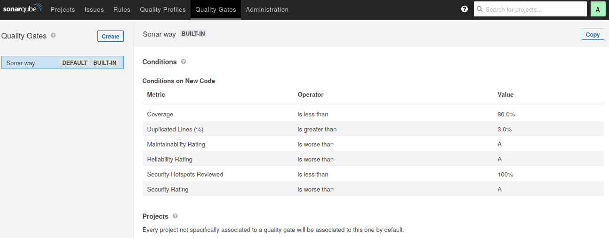

Default quality gate in SonarQubeBut, you can add yours. If you click on Create button, name the new quality gate and you can add your conditions on criteria computed by SonarQube.

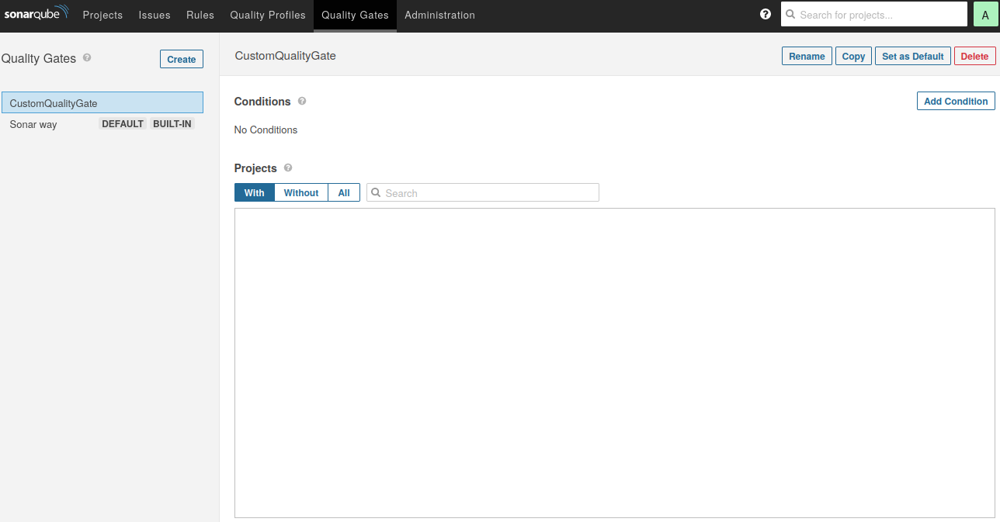

Create custom quality gateThen, in your project, you can select the quality gate you just created. In your Project Settings > Quality Gate and choose yours as specific Quality Gate.

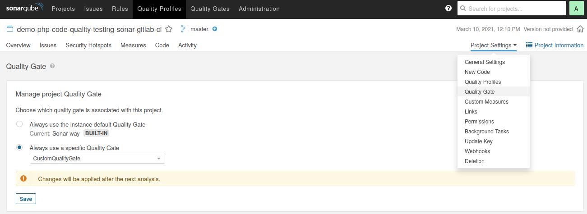

After saving, if you come back to the Quality Gate section, you can see your project will use your custom quality gate during the next analyze.

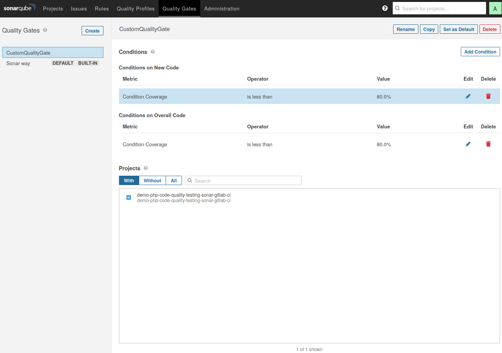

Then, I analyze my demonstration application thanks to the CI we built.

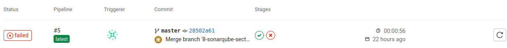

And... The CI tells us, we failed and it is about quality tests.


In SonarQube under the red block, SonarQube explains why.

> In the example, we set on overall code, the code coverage rate must be greater than 80%. Our score is at 75.8%, so the conditions are not verified. The quality analysis failed.

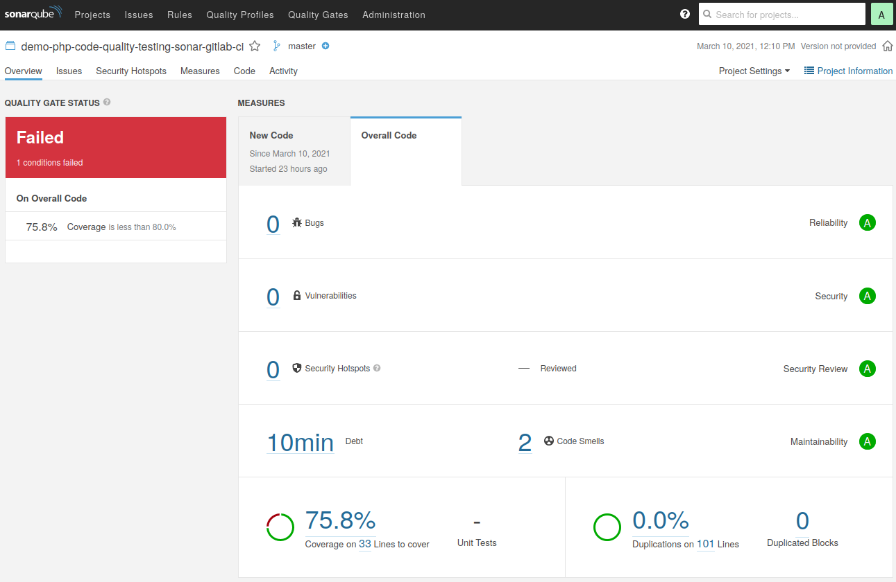

Moreover, SonarQube warn us there are some code smells.


By clicking on one of them, SonarQube shows your code.


And, it gives you the reason of the issue. In this example, it is very simple to see the issue and to fix it. Everyone makes mistakes, but with this kind of tools, you make your code cleaner.

Moreover, you can improve yourself, by understanding why there are code smells in the code you push in your branch.

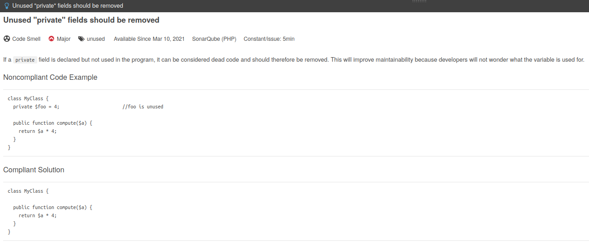

## Conclusion

In this article, we saw how to:

- create a CI in Gitlab for PHP applications using Composer and PHPUnit;
- embed test unit report and coverage rate in Gitlab interface;
- deploy a SonarQube instance using Docker;
- add SonarQube analysis in our previous CI;
- create quality gate in SonarQube and fail the pipeline if constraints are not satisfied.

Code sources are available [here](https://github.com/Treeptik/php-code-quality-testing-sonar-gitlab-ci).

Thanks for reading.
